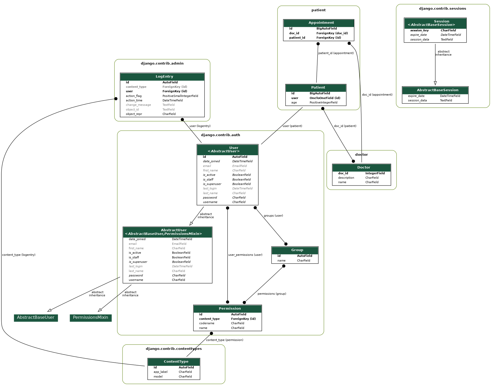
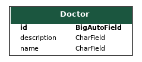
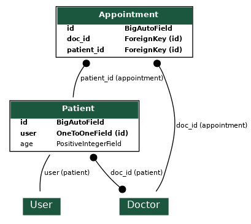

<div align="center" style="padding-bottom: 10px">
    <h1>Hospital Information System</h1>
    
    
    
</div>

## Motivation behind this project and features:
This project was inspired by [Dicoding Final Project Backend API](https://dicoding.com).
Initially I was finished the scholarship Dicoding Indonesia class of "Belajar Membuat Aplikasi Backend untuk Pemula". I got 5 stars for my final grad>

### Description:
**REST API** with CRUD operations on books objects.
Users can send requests to API to view books anonymously. 

### Used Frameworks, libraries, tools:
- Django

**Json Web Token Authentication** is 'rest_framework_simplejwt' package, which provides JWT implementation including DRF views for obtaining and refr>

### Tools:  
- Visual Studio Code, Heroku

Production database is Heroku Postgres.
Locally I used default SQLite database.

### Database schema:
ERD diagram including Django's base entities and manually created **Book** entity.


#### Doctor Model:

#### Patient Model (User) and Appointment Model (junction table):


To support many-to-many relationship, we need create a third table (known as a juction table), say Appointment, where each represents an appointment of a particular doctor. For the Appointment table, the primary key consists of two columns: doc_id and patient_id, the uniquely identify each row. The column doc_id and patient_id in Appointment table are used to reference Patient and Doctor tables, hence, they are also the foreign key in the Appointment table.

### Deployment: 
This repository has been deployed to Heroku. You can visit [here](https://books-api-dicoding.herokuapp.com/)
#### Step to reproduce deployment:
1. Create staticfiles folder and put any file into it.
(Make sure you made an exception in .gitignore for this file. Mine is called temp.)
2. Make sure there is Procfile is root directory with these 2 lines:
``release: python manage.py migrate --no-input``
``web: gunicorn core.wsgi``
3. Set `DEBUG = False`, add `django_heroku.settings(locals())` on the bottom of settings.py.
Make sure your **requirements.txt** contains every needed package. You may want to update it with
``pip freeze > requirements.txt``.
4. Go to [Heroku](https://dashboard.heroku.com/) and add new app.
5. Go to Resources tab and install **Heroku Postgres** add-on.
6. Go to Settings tab and set **SECRET_KEY** in config vars. Add **heroku/python** buildpack.
7. Go to Deploy tab, connect your Github repository, select branch to deploy.
You can Enable Automatic Deploys or Deploy Branch manually.
8. App should be up and running at ``https://<name_of_app>.herokuapp.com``.

### Local development:
Create new virtual environment, activate it and install dependencies.
```shell script
pip3 -m venv venv

. venv/bin/activate

pip install -r requirements.txt
```

Run migrations and create super user. (Making migrations might not be necessary)
```shell script
python manage.py makemigrations

python manage.py migrate

python manage.py createsuperuser
```
Run server and open your browser at `http://127.0.0.1:8000/`
```shell script
python manage.py runserver
```

### Possible future content:
- Permissions to access book (e.g only author can modify)
- More Query endpoint(get book by other attributes)
